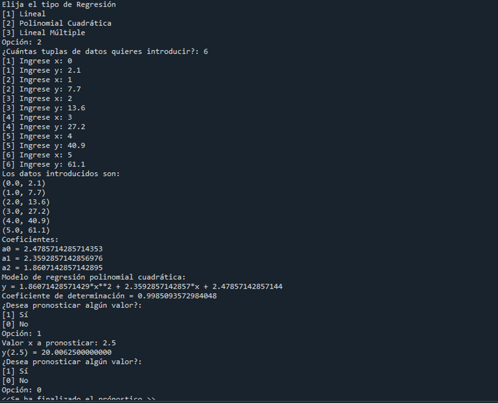

# Métodos Numéricos
## Raíces de función
[Resumen](resumen/raices_de_función/readme.md)

Resultado de Línea de Comando

## Sistema de Ecuaciones (Proyecto 2)
[Resumen](resumen/Regresión/readme.md)

Resultado de Línea de Comando

## Regresión de Datos (Proyecto 3)
[Resumen](resumen/Regresión/readme.md)

Interfaz para Regresión Multilineal en Java

# Matsup
## Series Fourier

Resolución de una función con cualidades de Media Onda Impar, coercible a Cuarto de onda

