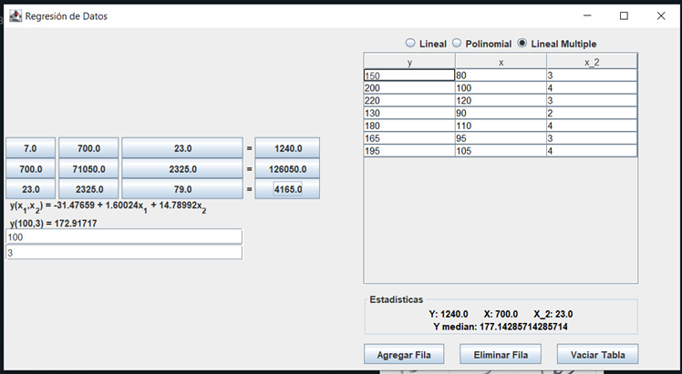
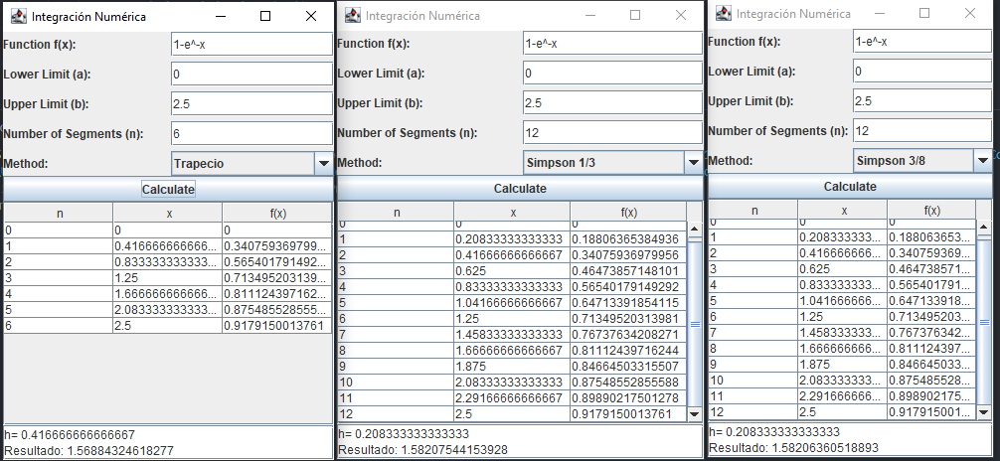
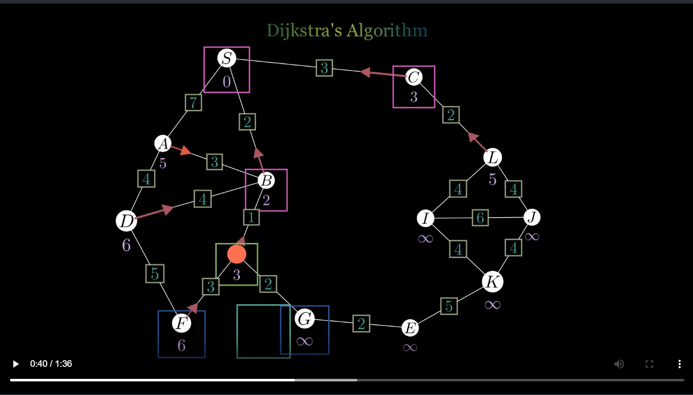
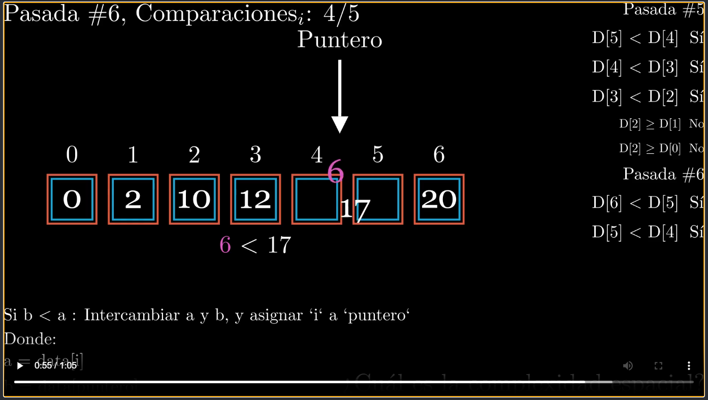
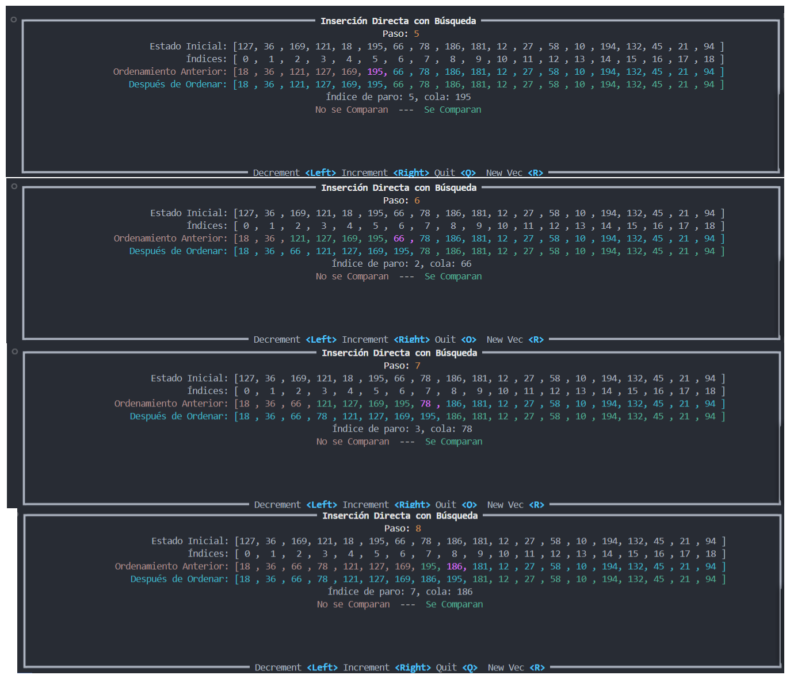

# Métodos Numéricos
## Raíces de función
[Resumen](resumen/Pry1_raices_de_función/readme.md)

Resultado de Línea de Comando (Java)

## Sistema de Ecuaciones (Proyecto 2)
[Resumen](resumen/Pry2_Sistemas%20de%20Ecuación/readme.md)

Resultado de Línea de Comando

## Regresión de Datos (Proyecto 3)
[Resumen](resumen/Pry3_Regresión/readme.md)

Interfaz para Regresión Multilineal en Java

## Integración Numérica (Proyecto 4)
[Resumen](resumen/Pry4_Integración/readme.md)

# Estructura de Datos

## Resolución de Grafos con Dijkstra

Un algoritmo visualizado con Manim. Busca la rutas más cortas desde un nodo inicial hasta todos los demás nodos.

Se hizo uso de una escena 3D solo por capricho personal. Pero no es necesario para la demostración del algoritmo.

## Inserción Directa
***Inserción Directa con búsqueda Simple usando Manim***. 

La lógica de reordenamiento y comparación fue incrustada dentro del código de animación.

***Inserción Directa con búsqueda binaria***. 

La estrategia de reordenamiento es exactamente el mismo (conceptualmente), solo que la estrategia para resolver la búsqueda del índice de inserción aprovecha el hecho de que el segmento procesado está ordenado.

Se hizo uso de [ratatui.rs](https://github.com/ratatui/ratatui) y su [guía quickstart](https://github.com/ratatui/ratatui?tab=readme-ov-file#quickstart) para implementar una visualización de reordenamiento por inserción.

# Matsup
## Series Fourier

Resolución de una función con cualidades de Media Onda Impar, coercible a Cuarto de onda

