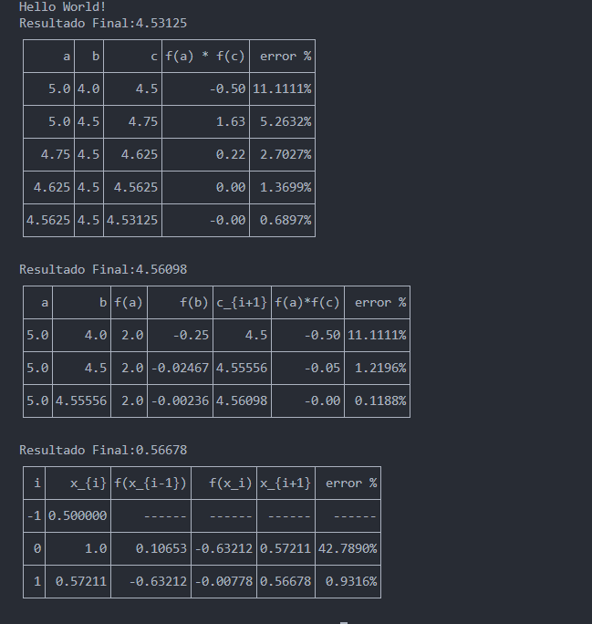

**Tabla de Contenido**

- [Información del proyecto](#información-del-proyecto)
- [Instrucciones de la tarea](#instrucciones-de-la-tarea)
  - [**Instrucciones:**](#instrucciones)
    - [Implementación en Java:](#implementación-en-java)
    - [Implementación en Python:](#implementación-en-python)
    - [Documentación:](#documentación)
    - [Criterios de Evaluación:](#criterios-de-evaluación)
- [Muestra del proyecto.](#muestra-del-proyecto)
  - [Muestra 1](#muestra-1)
- [FIN DEL ARCHIVO](#fin-del-archivo)

# Información del proyecto

    Tema: Aproximación de una función
    Fecha de entrega: 2024/09/30

# Instrucciones de la tarea

***

El objetivo de esta tarea es que los estudiantes apliquen los conceptos de métodos numéricos para la estimación de raíces individuales de una función, utilizando los lenguajes de programación Java y Python. Los estudiantes deben implementar los métodos de Bisección, Regla Falsa y Secante en ambos lenguajes, y analizar los resultados obtenidos.

## **Instrucciones:**

El programa a desarrollar debe resolver el siguiente problema: 

Dada la función  

$$f(x)=x^3-6x^2+11x-6$$

se requiere determinar una de sus raíces reales en el intervalo [1.5 y 2.5]

El proyecto debe entregarse en base a la plantilla de proyectos.

***

### Implementación en Java:

* Desarrolle un programa en Java que implemente los siguientes métodos numéricos para la estimación de raíces de una función dada:
  - Método de Bisección.
  - Método de la Regla Falsa.
  - Método de la Secante.
- El programa debe recibir como entrada la función, el intervalo o puntos iniciales según el método, y el criterio de convergencia (tolerancia y número máximo de iteraciones).
- El programa debe mostrar en consola los resultados de las estimaciones, incluyendo la raíz aproximada, el número de iteraciones realizadas, y el error final.

******************

### Implementación en Python:

* Desarrolle un programa en Python que implemente los mismos métodos numéricos (Bisección, Regla Falsa y Secante) para la estimación de raíces.
* Al igual que en la versión de Java, el programa debe permitir ingresar la función, el intervalo o puntos iniciales, y el criterio de convergencia.
* Además de imprimir los resultados en consola (raíz aproximada, número de iteraciones y error final), la versión en Python debe generar una gráfica de la función en la región cercana a la raíz estimada.
* La gráfica debe incluir la función original y marcar visualmente la raíz estimada.

******************

### Documentación:

* Cada programa debe incluir comentarios que expliquen claramente el código y los pasos seguidos en la implementación de cada método.
* En un archivo de texto o documento, compare los resultados obtenidos en Java y Python. Discuta cualquier diferencia que pueda surgir y explique posibles razones.
* Incluya capturas de pantalla de la ejecución del programa en Python, especialmente la gráfica generada.

******************

### Criterios de Evaluación:

* Correctitud y funcionalidad del código en ambos lenguajes. 30 puntos.
* Claridad y eficiencia en la implementación de los métodos numéricos. 25 puntos.
* Calidad y precisión de las gráficas generadas en Python.  20 puntos.
* Calidad de la documentación y análisis comparativo entre Java y Python. 10 puntos.
* Uso adecuado de técnicas de programación (estructuras de control, funciones, manejo de errores, etc.). 15 puntos.

# Muestra del proyecto.
## Muestra 1

Funciones: Bisección, Regla Falsa y Secante respectivamente 
****

************************************
# FIN DEL ARCHIVO
************************************