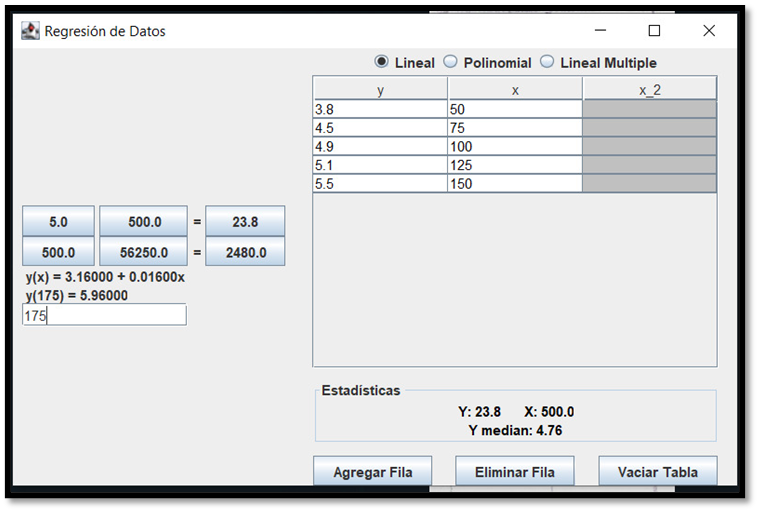

# Proyecto 3

**Due:** October 27, 2024, 11:59 PM

## Showcase

El objetivo de esta tarea es que los estudiantes apliquen los conceptos de métodos numéricos para la resolución de problemas de Ajuste de Curvas (Regresión), utilizando los lenguajes de programación Java y Python. Los estudiantes deben implementar los métodos de Regresión Lineal, Regresión Lineal Múltiple y Regresión Polinomial.

---

## Instrucciones:

El programa a desarrollar debe resolver alguno de los problemas de práctica vistos en clases. Deberá mostrar evidencia de solución de cada método de regresión.

El proyecto debe entregarse en base a la plantilla de proyectos.

---

### 1. Implementación en Java:

- Desarrolle un programa en **Java** que implemente los siguientes métodos numéricos:
  - **Regresión Lineal**
  - **Regresión Lineal Múltiple** (2 variables independientes)
  - **Regresión Polinomial** (2do. grado)

- El programa debe recibir interactivamente como entrada los datos, y valores a pronosticar.

- El programa debe mostrar en consola los resultados considerando mostrar la ecuación que representa el modelo de regresión, el coeficiente de determinación, y el resultado del pronóstico.

---

### 2. Implementación en Python:

- Desarrolle un programa en **Python** que implemente los mismos métodos numéricos, para solucionar los mismos problemas. A esto considere mostrar una gráfica de dispersión que muestre los datos. No es necesaria que muestre la línea de tendencia.

---

### 3. Documentación:

- Cada programa debe incluir **comentarios** que expliquen claramente el código y los pasos seguidos en la implementación de cada método.
  
- **Incluya capturas de pantalla** de la ejecución del programa.

---

### 4. Criterios de Evaluación:

1. **Correctitud y funcionalidad** del código en ambos lenguajes. *30 puntos*.

2. **Claridad y eficiencia** en la implementación de los métodos numéricos. *30 puntos*.

3. **Calidad de la documentación** y análisis comparativo entre Java y Python. *20 puntos*.

4. **Uso adecuado de técnicas de programación** (estructuras de control, funciones, manejo de errores, etc.). *20 puntos*.
